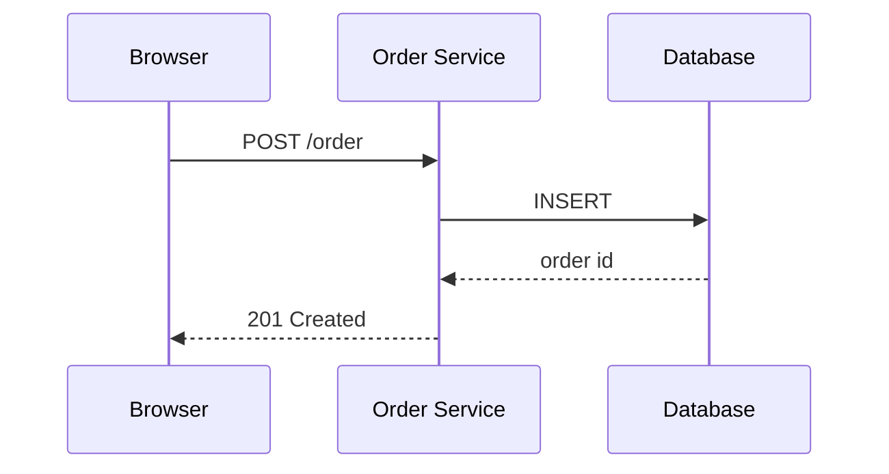
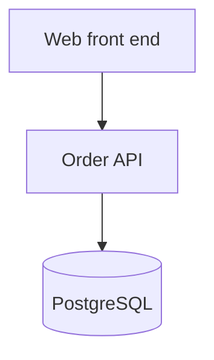
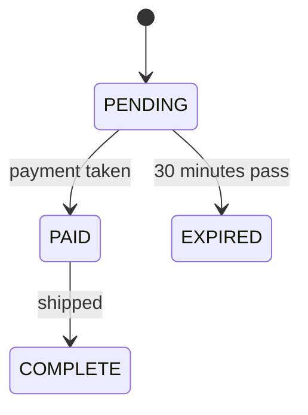

# Diagrams

Draw one only when the shape is hard to hold in your head: three or more parts talking to each
other, a sequence that loops or branches, or a state that changes over time. Two boxes and an arrow
need a sentence, not a picture.

Keep it small — six boxes at most, and under about 70 characters wide so it does not wrap. Put one
sentence above it saying what it shows.

**Plain text** in the conversation, because the terminal does not render Mermaid. **Mermaid** in a
file that something will render.

## Plain text

Calls between parts:

```
  Browser        API Gateway        Order Service        Database
     |                |                   |                  |
     |- POST /order ->|                   |                  |
     |                |- createOrder() -->|                  |
     |                |                   |--- INSERT ------>|
     |                |<-- 201 Created ---|                  |
     |<- 201 Created -|                   |                  |
```

Structure:

```
        +-----------------+
        |  Web front end  |
        +--------+--------+
                 |
        +--------v--------+
        |    Order API    |
        +--------+--------+
                 |
        +--------v--------+
        |   PostgreSQL    |
        +-----------------+
```

Steps and branches:

```
  Feed --> [ Fetch ] --> [ Validate ] --> [ Save ] --> Database
                              |
                           reject
                              v
                          Error log
```

States:

```
  PENDING --(paid)--> PAID --(shipped)--> COMPLETE
     |
     | (30m timeout)
     v
  EXPIRED
```

## Mermaid







## Labelling

- Label every arrow with what travels along it or what triggers it. An unlabelled arrow only says
  "these two are related".
- Use the real names from the code, so the reader can search for them.
- Leaving a component out is fine. Say so in one line: "authentication is left out here".
